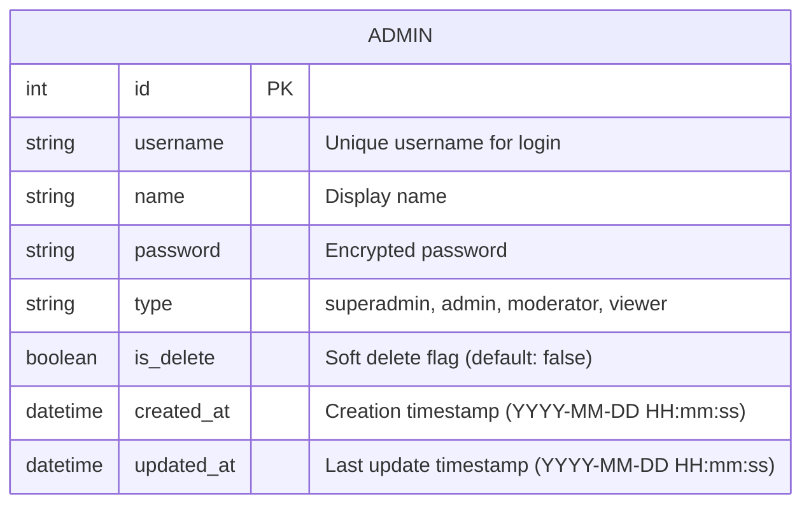

# Admin Management System - Documentation

## Overview

This document describes the admin management functionality for the Semester Reading Group Management System. The admin management system provides complete CRUD operations for managing administrator accounts with role-based access control.

## Admin Entity

### Data Model

| Field      | Type      | Constraints                 | Description                             |
|------------|-----------|-----------------------------|------------------------------------------|
| id         | Integer   | Primary Key, Auto-increment | Unique identifier                        |
| username   | String    | Not null, Unique            | Admin username for login                 |
| name       | String    | Not null                    | Admin display name                       |
| password   | String    | Not null                    | Admin password                           |
| type       | String    | Not null                    | Admin type/role                          |
| is_delete  | Boolean   | Not null, Default: false    | Soft delete flag                         |
| created_at | DateTime  | Not null                    | Creation timestamp (YYYY-MM-DD HH:mm:ss) |
| updated_at | DateTime  | Not null                    | Last update timestamp (YYYY-MM-DD HH:mm:ss) |

### Admin Types

The `type` field defines the admin's role and permissions:
- **superadmin** - Full system access with all privileges
- **admin** - Standard admin access for managing content
- **moderator** - Limited access for content moderation
- **viewer** - Read-only access, cannot create, update, or delete

### Database Schema



**Note:** Admin entity is standalone with no foreign key relationships to other entities.

## API Endpoints

Base URL: `/api/admin`

### 1. Create Admin

Creates a new administrator account.

```http
POST /api/admin/create
Content-Type: application/json
```

**Request Body:**
```json
{
  "username": "admin",
  "name": "Administrator",
  "password": "password123",
  "type": "superadmin"
}
```

**Response:** `201 Created`
```json
{
  "id": 1,
  "username": "admin",
  "name": "Administrator",
  "password": "password123",
  "type": "superadmin",
  "is_delete": false,
  "created_at": "2026-02-19 14:30:00",
  "updated_at": "2026-02-19 14:30:00"
}
```

**Validation Rules:**
- **username:** Required, must be unique across all admins, min length 3 characters, alphanumeric and underscore only
- **name:** Required, admin's display name, min length 2 characters
- **password:** Required, minimum 8 characters (consider implementing password complexity rules)
- **type:** Required, must be one of: "superadmin", "admin", "moderator", "viewer"

**Automatic Fields:**
- **created_at:** Automatically set to current datetime when admin is created
- **updated_at:** Automatically set to current datetime when admin is created
- **is_delete:** Automatically set to `false` when admin is created

**Error Responses:**
- `400 Bad Request` - Invalid input or duplicate username
- `500 Internal Server Error` - Server error

---

### 2. Update Admin

Updates an existing administrator account.

```http
PUT /api/admin/update
Content-Type: application/json
```

**Request Body:**
```json
{
  "id": 1,
  "username": "admin",
  "name": "Administrator",
  "password": "newpassword456",
  "type": "admin"
}
```

**Response:** `200 OK`
```json
{
  "id": 1,
  "username": "admin",
  "name": "Administrator",
  "password": "newpassword456",
  "type": "admin",
  "is_delete": false,
  "created_at": "2026-02-19 14:30:00",
  "updated_at": "2026-02-19 15:45:00"
}
```

**Validation Rules:**
- **id:** Required, must exist
- **username:** Required, must be unique (can keep same username if updating same admin)
- **name:** Required, display name
- **password:** Required, minimum 8 characters
- **type:** Required, must be valid admin type

**Automatic Fields:**
- **updated_at:** Automatically updated to current datetime when admin is updated

**Error Responses:**
- `400 Bad Request` - Invalid input or duplicate username
- `404 Not Found` - Admin ID not found
- `500 Internal Server Error` - Server error

---

### 3. Get Admin List

Retrieves all administrator accounts.

```http
GET /api/admin/list
```

**Response:** `200 OK`
```json
[
  {
    "id": 1,
    "username": "admin",
    "name": "Administrator",
    "password": "password123",
    "type": "superadmin",
    "is_delete": false,
    "created_at": "2026-02-19 14:30:00",
    "updated_at": "2026-02-19 14:30:00"
  },
  {
    "id": 2,
    "username": "moderator1",
    "name": "Moderator User",
    "password": "password456",
    "type": "moderator",
    "is_delete": false,
    "created_at": "2026-02-19 14:35:00",
    "updated_at": "2026-02-19 14:35:00"
  },
  {
    "id": 3,
    "username": "viewer1",
    "name": "Viewer User",
    "password": "password789",
    "type": "viewer",
    "is_delete": false,
    "created_at": "2026-02-19 14:40:00",
    "updated_at": "2026-02-19 14:40:00"
  }
]
```

**Query Behavior:**
- By default, only returns admins where `is_delete = false`
- Deleted admins are automatically excluded from the list

**Note:** In production, passwords should NOT be returned in API responses. Consider implementing a DTO (Data Transfer Object) pattern to exclude sensitive fields.

---

### 4. Get Admin by ID

Retrieves a specific administrator by ID.

```http
GET /api/admin/{id}
```

**Path Parameters:**
- `id` (Integer) - Admin ID

**Response:** `200 OK`
```json
{
  "id": 1,
  "username": "admin",
  "name": "Administrator",
  "password": "password123",
  "type": "superadmin",
  "is_delete": false,
  "created_at": "2026-02-19 14:30:00",
  "updated_at": "2026-02-19 14:30:00"
}
```

**Error Responses:**
- `404 Not Found` - Admin ID not found
- `500 Internal Server Error` - Server error

---

### 5. Delete Admin

Soft deletes an administrator account by setting `is_delete` to `true`.

```http
DELETE /api/admin/delete/{id}
```

**Path Parameters:**
- `id` (Integer) - Admin ID to delete

**Response:** `200 OK`
```json
{
  "success": true,
  "message": "Admin deleted successfully"
}
```

**Implementation Details:**
- This is a **soft delete** operation - the admin record is NOT removed from the database
- The `is_delete` field is set to `true`
- The `updated_at` field is updated to current datetime
- Deleted admins are excluded from list queries by default
- Username remains reserved (cannot be reused)
- Can be restored by setting `is_delete` back to `false`

**Error Responses:**
- `404 Not Found` - Admin ID not found
- `400 Bad Request` - Admin already deleted
- `400 Bad Request` - Cannot delete the last active superadmin
- `500 Internal Server Error` - Server error

**Important Notes:**
- Soft delete prevents accidental data loss
- Maintains referential integrity and audit trail
- Prevents deletion of the last active superadmin account
- Consider adding confirmation mechanism for delete operations
- Consider adding a restore endpoint for undeleting admins

---

### 6. Admin Login

Authenticates an admin user and creates a session.

```http
POST /api/admin/login
Content-Type: application/json
```

**Request Body:**
```json
{
  "username": "admin",
  "password": "password123"
}
```

**Response:** `200 OK`
```json
{
  "success": true,
  "message": "Login successful",
  "admin": {
    "id": 1,
    "username": "admin",
    "name": "Administrator",
    "type": "superadmin",
    "is_delete": false,
    "created_at": "2026-02-19 14:30:00",
    "updated_at": "2026-02-19 14:30:00"
  },
  "token": "eyJhbGciOiJIUzI1NiIsInR5cCI6IkpXVCJ9..."
}
```

**Validation Rules:**
- **username:** Required, must exist in database
- **password:** Required, must match the stored password
- **is_delete:** Admin account must have `is_delete = false` (active account)

**Login Logic:**
1. Verify username exists
2. **Check if `is_delete = false`** (account is active)
3. Verify password matches
4. Create session or JWT token
5. Return admin info (without password)

**Error Responses:**
- `400 Bad Request` - Missing username or password
- `401 Unauthorized` - Invalid username or password
- `403 Forbidden` - Account has been deleted (`is_delete = true`)
- `500 Internal Server Error` - Server error

**Important Security Notes:**
- **CRITICAL:** Only active admins (`is_delete = false`) can login
- **Deleted admins (`is_delete = true`) cannot login** and will receive 403 Forbidden error
- Password should be validated using BCrypt or similar hashing
- Implement rate limiting to prevent brute force attacks
- Consider adding account lockout after failed login attempts
- Never return the password in the response
- Consider updating a `last_login` timestamp on successful login

## Project Structure

The admin management system follows the same layered architecture as other entities:

```
src/main/java/com/example/sample/
├── controller/
│   └── AdminController.java           # Admin REST endpoints
├── service/
│   └── AdminService.java              # Admin business logic
├── repository/
│   └── AdminRepository.java           # Admin data access
└── model/
    └── Admin.java                     # Admin entity
```

## Implementation Example

### Using cURL

**Create an admin:**
```bash
curl -X POST http://localhost:8080/api/admin/create \
  -H "Content-Type: application/json" \
  -d '{
    "username": "admin",
    "name": "Administrator",
    "password": "password123",
    "type": "superadmin"
  }'
```

**Get all admins:**
```bash
curl http://localhost:8080/api/admin/list
```

**Get admin by ID:**
```bash
curl http://localhost:8080/api/admin/1
```

**Update admin:**
```bash
curl -X PUT http://localhost:8080/api/admin/update \
  -H "Content-Type: application/json" \
  -d '{
    "id": 1,
    "username": "admin",
    "name": "Administrator",
    "password": "newpassword456",
    "type": "admin"
  }'
```

**Delete admin (soft delete):**
```bash
curl -X DELETE "http://localhost:8080/api/admin/delete/1"
```

**Login admin:**
```bash
curl -X POST http://localhost:8080/api/admin/login \
  -H "Content-Type: application/json" \
  -d '{
    "username": "admin",
    "password": "password123"
  }'
```

## Security Considerations

**CRITICAL - The current implementation has security vulnerabilities:**

### 1. Password Storage
- **Current:** Passwords stored in plain text
- **Required:** Implement BCrypt, Argon2, or PBKDF2 password hashing
```java
// Example with BCrypt
String hashedPassword = BCryptPasswordEncoder.encode(rawPassword);
```

### 2. Password in API Responses
- **Current:** Passwords returned in GET requests
- **Required:** Create AdminDTO without password field for responses
```java
import java.time.LocalDateTime;
import java.time.format.DateTimeFormatter;

public class AdminDTO {
    private Integer id;
    private String username;
    private String name;
    private String type;
    private Boolean isDelete;
    private String createdAt;  // Formatted as YYYY-MM-DD HH:mm:ss
    private String updatedAt;  // Formatted as YYYY-MM-DD HH:mm:ss
    // No password field

    // Convert from Entity to DTO
    public static AdminDTO fromEntity(Admin admin) {
        DateTimeFormatter formatter = DateTimeFormatter.ofPattern("yyyy-MM-dd HH:mm:ss");
        AdminDTO dto = new AdminDTO();
        dto.setId(admin.getId());
        dto.setUsername(admin.getUsername());
        dto.setName(admin.getName());
        dto.setType(admin.getType());
        dto.setIsDelete(admin.getIsDelete());
        dto.setCreatedAt(admin.getCreatedAt().format(formatter));
        dto.setUpdatedAt(admin.getUpdatedAt().format(formatter));
        return dto;
    }
}
```

### 3. Authentication
- **Current:** No authentication mechanism
- **Required:** Implement JWT or session-based authentication
- Admins should login before accessing protected endpoints

### 4. Authorization
- **Current:** No role-based access control
- **Required:** Implement authorization based on admin type
  - **Superadmin:** Full access to all operations
  - **Admin:** Can manage content, cannot modify superadmin accounts
  - **Moderator:** Limited access for content moderation, read-only for admin management
  - **Viewer:** Read-only access to all data, cannot create, update, or delete

### 5. Input Validation
- **Required:** Add comprehensive validation
```java
@NotBlank(message = "Username is required")
@Size(min = 3, max = 50)
@Pattern(regexp = "^[a-zA-Z0-9_]+$", message = "Username must be alphanumeric")
private String username;

@NotBlank(message = "Name is required")
@Size(min = 2, max = 100)
private String name;

@NotBlank(message = "Password is required")
@Size(min = 8, message = "Password must be at least 8 characters")
@Pattern(regexp = "^(?=.*[A-Z])(?=.*[a-z])(?=.*\\d).*$",
         message = "Password must contain uppercase, lowercase, and digit")
private String password;
```

### 6. Audit Logging
- **Required:** Log all admin operations
  - Who created/modified/deleted admin accounts
  - When the operation occurred
  - What changes were made

### 7. Rate Limiting
- **Required:** Prevent brute force attacks
  - Limit login attempts
  - Implement account lockout after failed attempts

### 8. HTTPS Only
- **Required:** All admin operations must use HTTPS in production
- Never transmit passwords over HTTP

## Best Practices

### 1. Default Admin Account
Update `DataInitializer.java` to create a default admin:
```java
Admin defaultAdmin = new Admin();
defaultAdmin.setUsername("admin");
defaultAdmin.setName("System Administrator");
defaultAdmin.setPassword(passwordEncoder.encode("change-me-on-first-login"));
defaultAdmin.setType("superadmin");
defaultAdmin.setIsDelete(false);
defaultAdmin.setCreatedAt(LocalDateTime.now());
defaultAdmin.setUpdatedAt(LocalDateTime.now());
adminRepository.save(defaultAdmin);
```

### 2. Force Password Change
- Require password change on first login
- Implement password expiration policy (e.g., 90 days)

### 3. Username Validation
- Min length: 3 characters
- Max length: 50 characters
- Allow only alphanumeric characters and underscore
- Case-insensitive uniqueness check
- Cannot be changed after creation (or allow with special confirmation)

### 4. Password Policy
- Minimum 8 characters
- Require uppercase, lowercase, digit, and special character
- Prevent common passwords
- No password reuse (store password history)

### 5. Soft Delete Implementation
The system implements soft delete using the `is_delete` flag:
```java
@Column(name = "is_delete")
private Boolean isDelete = false;

// When deleting
admin.setIsDelete(true);
adminRepository.save(admin);

// Query only active admins
List<Admin> activeAdmins = adminRepository.findByIsDelete(false);
```

**Benefits of Soft Delete:**
- Preserves historical data and audit trail
- Allows data recovery if deleted by mistake
- Maintains referential integrity
- Prevents username reuse (security best practice)

### 6. Activity Tracking
Timestamp fields are automatically managed:
```java
@Column(name = "created_at", nullable = false, updatable = false)
private LocalDateTime createdAt;

@Column(name = "updated_at", nullable = false)
private LocalDateTime updatedAt;

// Optional: track last login
@Column(name = "last_login")
private LocalDateTime lastLogin;

// Set timestamps before persisting
@PrePersist
protected void onCreate() {
    createdAt = LocalDateTime.now();
    updatedAt = LocalDateTime.now();
}

@PreUpdate
protected void onUpdate() {
    updatedAt = LocalDateTime.now();
}
```

**Note:** The format for timestamp fields is `YYYY-MM-DD HH:mm:ss` (e.g., "2026-02-19 14:30:00")

## Testing Examples

### Postman Collection

**Base URL:** `http://localhost:8080`

1. **Create Admin**
   - Method: POST
   - URL: `/api/admin/create`
   - Headers: `Content-Type: application/json`
   - Body:
   ```json
   {
     "username": "testadmin",
     "name": "Test Admin",
     "password": "Test@1234",
     "type": "admin"
   }
   ```

2. **Get All Admins**
   - Method: GET
   - URL: `/api/admin/list`

3. **Get Admin by ID**
   - Method: GET
   - URL: `/api/admin/1`

4. **Update Admin**
   - Method: PUT
   - URL: `/api/admin/update`
   - Headers: `Content-Type: application/json`
   - Body:
   ```json
   {
     "id": 1,
     "username": "testadmin",
     "name": "Test Admin Updated",
     "password": "NewPass@1234",
     "type": "moderator"
   }
   ```

5. **Delete Admin**
   - Method: DELETE
   - URL: `/api/admin/delete/1`
   - Note: This is a soft delete (sets `is_delete = true`)

6. **Login Admin**
   - Method: POST
   - URL: `/api/admin/login`
   - Headers: `Content-Type: application/json`
   - Body:
   ```json
   {
     "username": "admin",
     "password": "password123"
   }
   ```
   - Note: Only active admins (`is_delete = false`) can login

## Frontend Integration

### Service Layer (adminService.js)

```javascript
import apiService from './apiService';

const ADMIN_BASE_URL = '/api/admin';

export const adminService = {
  // Get all admins
  getAllAdmins: async () => {
    const response = await apiService.get(`${ADMIN_BASE_URL}/list`);
    return response.data;
  },

  // Get admin by ID
  getAdminById: async (id) => {
    const response = await apiService.get(`${ADMIN_BASE_URL}/${id}`);
    return response.data;
  },

  // Create admin
  createAdmin: async (adminData) => {
    const response = await apiService.post(`${ADMIN_BASE_URL}/create`, adminData);
    return response.data;
  },

  // Update admin
  updateAdmin: async (adminData) => {
    const response = await apiService.put(`${ADMIN_BASE_URL}/update`, adminData);
    return response.data;
  },

  // Delete admin (soft delete)
  deleteAdmin: async (id) => {
    const response = await apiService.delete(`${ADMIN_BASE_URL}/delete/${id}`);
    return response.data;
  },

  // Login admin
  loginAdmin: async (username, password) => {
    const response = await apiService.post(`${ADMIN_BASE_URL}/login`, {
      username,
      password
    });
    return response.data;
  }
};

export default adminService;
```

### React Component Example (Admins.jsx)

```javascript
import { useState, useEffect } from 'react';
import adminService from '../services/adminService';

function Admins() {
  const [admins, setAdmins] = useState([]);
  const [showModal, setShowModal] = useState(false);
  const [formData, setFormData] = useState({
    id: null,
    username: '',
    name: '',
    password: '',
    type: 'admin'
  });

  useEffect(() => {
    loadAdmins();
  }, []);

  const loadAdmins = async () => {
    try {
      const data = await adminService.getAllAdmins();
      setAdmins(data);
    } catch (error) {
      console.error('Error loading admins:', error);
    }
  };

  const handleSubmit = async (e) => {
    e.preventDefault();
    try {
      if (formData.id) {
        await adminService.updateAdmin(formData);
      } else {
        await adminService.createAdmin(formData);
      }
      setShowModal(false);
      loadAdmins();
      resetForm();
    } catch (error) {
      console.error('Error saving admin:', error);
    }
  };

  const handleDelete = async (id) => {
    if (window.confirm('Are you sure you want to delete this admin?')) {
      try {
        await adminService.deleteAdmin(id);
        loadAdmins();
      } catch (error) {
        console.error('Error deleting admin:', error);
      }
    }
  };

  const resetForm = () => {
    setFormData({ id: null, username: '', name: '', password: '', type: 'admin' });
  };

  return (
    <div className="admins-container">
      <h1>Admin Management</h1>
      <button onClick={() => setShowModal(true)}>Create Admin</button>

      <table>
        <thead>
          <tr>
            <th>ID</th>
            <th>Username</th>
            <th>Name</th>
            <th>Type</th>
            <th>Actions</th>
          </tr>
        </thead>
        <tbody>
          {admins.map(admin => (
            <tr key={admin.id}>
              <td>{admin.id}</td>
              <td>{admin.username}</td>
              <td>{admin.name}</td>
              <td>{admin.type}</td>
              <td>
                <button onClick={() => {
                  setFormData(admin);
                  setShowModal(true);
                }}>Edit</button>
                <button onClick={() => handleDelete(admin.id)}>Delete</button>
              </td>
            </tr>
          ))}
        </tbody>
      </table>

      {showModal && (
        <div className="modal">
          <form onSubmit={handleSubmit}>
            <h2>{formData.id ? 'Edit Admin' : 'Create Admin'}</h2>

            <input
              type="text"
              placeholder="Username"
              value={formData.username}
              onChange={(e) => setFormData({...formData, username: e.target.value})}
              required
            />

            <input
              type="text"
              placeholder="Display Name"
              value={formData.name}
              onChange={(e) => setFormData({...formData, name: e.target.value})}
              required
            />

            <input
              type="password"
              placeholder="Password"
              value={formData.password}
              onChange={(e) => setFormData({...formData, password: e.target.value})}
              required
            />

            <select
              value={formData.type}
              onChange={(e) => setFormData({...formData, type: e.target.value})}
              required
            >
              <option value="superadmin">Superadmin</option>
              <option value="admin">Admin</option>
              <option value="moderator">Moderator</option>
              <option value="viewer">Viewer</option>
            </select>

            <button type="submit">Save</button>
            <button type="button" onClick={() => {
              setShowModal(false);
              resetForm();
            }}>Cancel</button>
          </form>
        </div>
      )}
    </div>
  );
}

export default Admins;
```

## Database Queries

### H2 SQL Queries

```sql
-- Create admin table
CREATE TABLE admin (
    id INTEGER AUTO_INCREMENT PRIMARY KEY,
    username VARCHAR(50) NOT NULL UNIQUE,
    name VARCHAR(100) NOT NULL,
    password VARCHAR(255) NOT NULL,
    type VARCHAR(20) NOT NULL,
    is_delete BOOLEAN NOT NULL DEFAULT FALSE,
    created_at TIMESTAMP NOT NULL,
    updated_at TIMESTAMP NOT NULL
);

-- Insert default admin
INSERT INTO admin (username, name, password, type, is_delete, created_at, updated_at)
VALUES ('admin', 'Administrator', 'password123', 'superadmin', FALSE,
        CURRENT_TIMESTAMP, CURRENT_TIMESTAMP);

-- Get all active admins (excludes soft deleted)
SELECT * FROM admin WHERE is_delete = FALSE;

-- Get all admins (including soft deleted)
SELECT * FROM admin;

-- Get admin by ID (only if not deleted)
SELECT * FROM admin WHERE id = 1 AND is_delete = FALSE;

-- Get admin by username (only if not deleted)
SELECT * FROM admin WHERE username = 'admin' AND is_delete = FALSE;

-- Update admin (automatically update updated_at)
UPDATE admin
SET username = 'newusername',
    name = 'New Name',
    password = 'newpassword',
    type = 'admin',
    updated_at = CURRENT_TIMESTAMP
WHERE id = 1;

-- Soft delete admin (update is_delete and updated_at)
UPDATE admin
SET is_delete = TRUE,
    updated_at = CURRENT_TIMESTAMP
WHERE id = 1;

-- Restore deleted admin (update is_delete and updated_at)
UPDATE admin
SET is_delete = FALSE,
    updated_at = CURRENT_TIMESTAMP
WHERE id = 1;

-- Hard delete admin (not recommended, use soft delete instead)
DELETE FROM admin WHERE id = 1;

-- Count admins by type
SELECT type, COUNT(*) as count
FROM admin
GROUP BY type;
```

## Validation & Error Messages

### Common Validation Errors

| Error Code | Message | Cause |
|------------|---------|-------|
| 400 | "Username is required" | Missing username field |
| 400 | "Username must be at least 3 characters" | Username too short |
| 400 | "Username already exists" | Duplicate username |
| 400 | "Username must be alphanumeric" | Invalid characters in username |
| 400 | "Name is required" | Missing name field |
| 400 | "Name must be at least 2 characters" | Name too short |
| 400 | "Password is required" | Missing password field |
| 400 | "Password must be at least 8 characters" | Password too short |
| 400 | "Type is required" | Missing type field |
| 400 | "Invalid admin type" | Type not in allowed values (must be: superadmin, admin, moderator, viewer) |
| 404 | "Admin not found" | Admin ID doesn't exist |
| 400 | "Cannot delete last superadmin" | Attempting to delete only active superadmin |
| 400 | "Admin already deleted" | Attempting to delete an already soft-deleted admin |
| 401 | "Invalid username or password" | Login credentials are incorrect |
| 403 | "Account has been deleted" | Attempting to login with a deleted admin account (`is_delete = true`) |

## Additional Endpoints (Optional)

### Restore Deleted Admin

For systems that need to restore soft-deleted admins:

```http
PUT /api/admin/restore/{id}
```

**Implementation:**
```java
// In AdminService
public Admin restoreAdmin(Integer id) {
    Admin admin = adminRepository.findById(id)
        .orElseThrow(() -> new RuntimeException("Admin not found"));

    if (!admin.getIsDelete()) {
        throw new RuntimeException("Admin is not deleted");
    }

    admin.setIsDelete(false);
    return adminRepository.save(admin);
}
```

### Get Deleted Admins

Retrieve list of soft-deleted admins:

```http
GET /api/admin/deleted
```

**Response:** List of admins where `is_delete = true`

## Repository Query Methods

```java
public interface AdminRepository extends JpaRepository<Admin, Integer> {

    // Find all active (not deleted) admins
    List<Admin> findByIsDelete(Boolean isDelete);

    // Find admin by username (only active)
    Optional<Admin> findByUsernameAndIsDelete(String username, Boolean isDelete);

    // Check if username exists (including deleted)
    Boolean existsByUsername(String username);

    // Count active superadmins
    Long countByTypeAndIsDelete(String type, Boolean isDelete);

    // Find admins created after a certain date
    List<Admin> findByCreatedAtAfter(LocalDateTime date);

    // Find admins updated within a date range
    List<Admin> findByUpdatedAtBetween(LocalDateTime start, LocalDateTime end);
}
```

## Service Layer Logic

```java
import org.springframework.security.crypto.bcrypt.BCryptPasswordEncoder;

public class AdminService {

    @Autowired
    private AdminRepository adminRepository;

    @Autowired
    private BCryptPasswordEncoder passwordEncoder;

    // Create admin
    public Admin createAdmin(Admin admin) {
        LocalDateTime now = LocalDateTime.now();
        admin.setCreatedAt(now);
        admin.setUpdatedAt(now);
        admin.setIsDelete(false);
        return adminRepository.save(admin);
    }

    // Update admin
    public Admin updateAdmin(Admin admin) {
        Admin existing = adminRepository.findById(admin.getId())
            .orElseThrow(() -> new RuntimeException("Admin not found"));

        existing.setUsername(admin.getUsername());
        existing.setName(admin.getName());
        existing.setPassword(admin.getPassword());
        existing.setType(admin.getType());
        existing.setUpdatedAt(LocalDateTime.now());

        return adminRepository.save(existing);
    }

    // Get all active admins
    public List<Admin> getAllAdmins() {
        return adminRepository.findByIsDelete(false);
    }

    // Soft delete admin
    public void deleteAdmin(Integer id) {
        Admin admin = adminRepository.findById(id)
            .orElseThrow(() -> new RuntimeException("Admin not found"));

        if (admin.getIsDelete()) {
            throw new RuntimeException("Admin already deleted");
        }

        // Check if this is the last active superadmin
        if ("superadmin".equals(admin.getType())) {
            long activeSuperadmins = adminRepository
                .countByTypeAndIsDelete("superadmin", false);
            if (activeSuperadmins <= 1) {
                throw new RuntimeException("Cannot delete last active superadmin");
            }
        }

        admin.setIsDelete(true);
        admin.setUpdatedAt(LocalDateTime.now());
        adminRepository.save(admin);
    }

    // Login admin
    public Admin loginAdmin(String username, String password) {
        // Find admin by username (only active admins)
        Admin admin = adminRepository.findByUsernameAndIsDelete(username, false)
            .orElseThrow(() -> new RuntimeException("Invalid username or password"));

        // CRITICAL: Check if account is deleted
        if (admin.getIsDelete()) {
            throw new RuntimeException("Account has been deleted");
        }

        // Verify password (use BCrypt in production)
        if (!passwordEncoder.matches(password, admin.getPassword())) {
            throw new RuntimeException("Invalid username or password");
        }

        // Optional: Update last login timestamp
        admin.setLastLogin(LocalDateTime.now());
        adminRepository.save(admin);

        return admin;
    }
}
```

**Timestamp Format:**
- Store in database as TIMESTAMP
- Display/return as string in format: `YYYY-MM-DD HH:mm:ss`
- Example: `2026-02-19 14:30:00`

**Formatter Example:**
```java
import java.time.format.DateTimeFormatter;

DateTimeFormatter formatter = DateTimeFormatter.ofPattern("yyyy-MM-dd HH:mm:ss");
String formattedDate = admin.getCreatedAt().format(formatter);
```

## Admin Type Permissions Matrix

| Permission | Superadmin | Admin | Moderator | Viewer |
|------------|------------|-------|-----------|--------|
| Login | ✓** | ✓** | ✓** | ✓** |
| Create Admin | ✓ | ✓ | ✗ | ✗ |
| Update Admin | ✓ | ✓* | ✗ | ✗ |
| Delete Admin | ✓ | ✓* | ✗ | ✗ |
| View Admins | ✓ | ✓ | ✓ | ✓ |
| Manage Groups | ✓ | ✓ | ✓ | ✗ |
| Manage Persons | ✓ | ✓ | ✓ | ✗ |
| Manage Semesters | ✓ | ✓ | ✓ | ✗ |
| Manage Books | ✓ | ✓ | ✓ | ✗ |
| View Reports | ✓ | ✓ | ✓ | ✓ |

**Notes:**
- `*` Admin cannot modify Superadmin accounts
- `**` Only active admins (`is_delete = false`) can login. Deleted admins cannot login.
- Viewer has read-only access to all data
- Moderator can manage content but not admin accounts

## Participation Management Endpoints

The admin system provides comprehensive endpoints for managing participations with pagination support.

### Get All Participations (with Pagination)

Retrieves a paginated list of all participations.

```http
GET /api/admin/participations?page={page}&size={size}&sort={sort}
```

**Query Parameters:**
- `page` (Integer, Optional) - Page number (0-indexed, default: 0)
- `size` (Integer, Optional) - Number of items per page (default: 20, max: 100)
- `sort` (String, Optional) - Sort criteria (e.g., "participationDate,desc" or "id,asc")

**Response:** `200 OK`
```json
{
  "content": [
    {
      "participationId": 1,
      "semesterId": 1,
      "semesterName": "Spring 2026",
      "groupId": 1,
      "groupName": "Reading Group A",
      "personId": 1,
      "personName": "John Doe",
      "status": "ontime",
      "participationDate": "2026-03-08"
    },
    {
      "participationId": 2,
      "semesterId": 1,
      "semesterName": "Spring 2026",
      "groupId": 1,
      "groupName": "Reading Group A",
      "personId": 2,
      "personName": "Jane Smith",
      "status": "late",
      "participationDate": "2026-03-08"
    }
  ],
  "pageable": {
    "pageNumber": 0,
    "pageSize": 20,
    "sort": {
      "sorted": true,
      "unsorted": false,
      "empty": false
    },
    "offset": 0,
    "paged": true,
    "unpaged": false
  },
  "totalElements": 50,
  "totalPages": 3,
  "last": false,
  "size": 20,
  "number": 0,
  "sort": {
    "sorted": true,
    "unsorted": false,
    "empty": false
  },
  "numberOfElements": 20,
  "first": true,
  "empty": false
}
```

### Get Participations by Semester (with Pagination)

Retrieves participations for a specific semester with pagination.

```http
GET /api/admin/participations/semester/{semesterId}?page={page}&size={size}
```

**Path Parameters:**
- `semesterId` (Integer) - Semester ID

**Query Parameters:**
- `page` (Integer, Optional) - Page number (default: 0)
- `size` (Integer, Optional) - Items per page (default: 20)

**Response:** `200 OK` - Same pagination format as above

### Get Participations by Group (with Pagination)

Retrieves participations for a specific group with pagination.

```http
GET /api/admin/participations/group/{groupId}?page={page}&size={size}
```

**Path Parameters:**
- `groupId` (Integer) - Group ID

**Query Parameters:**
- `page` (Integer, Optional) - Page number (default: 0)
- `size` (Integer, Optional) - Items per page (default: 20)

**Response:** `200 OK` - Same pagination format as above

### Get Participations by Person (with Pagination)

Retrieves participations for a specific person with pagination.

```http
GET /api/admin/participations/person/{personId}?page={page}&size={size}
```

**Path Parameters:**
- `personId` (Integer) - Person ID

**Query Parameters:**
- `page` (Integer, Optional) - Page number (default: 0)
- `size` (Integer, Optional) - Items per page (default: 20)

**Response:** `200 OK` - Same pagination format as above

### Get Participations with Filters

Retrieves participations with multiple filter criteria and pagination.

```http
GET /api/admin/participations/search?startDate={startDate}&endDate={endDate}&semesterId={semesterId}&groupId={groupId}&personId={personId}&status={status}&page={page}&size={size}&sort={sort}
```

**Query Parameters:**
- `startDate` (String, **Required**) - Filter by date range start (YYYY-MM-DD format)
- `endDate` (String, **Required**) - Filter by date range end (YYYY-MM-DD format)
- `semesterId` (Integer, Optional) - Filter by semester
- `groupId` (Integer, Optional) - Filter by group
- `personId` (Integer, Optional) - Filter by person
- `status` (String, Optional) - Filter by status (ontime, late, absent)
- `page` (Integer, Optional) - Page number (default: 0)
- `size` (Integer, Optional) - Items per page (default: 20)
- `sort` (String, Optional) - Sort criteria (e.g., "participationDate,desc")

**Response:** `200 OK` - Same pagination format as above

**Validation Rules:**
- `startDate` and `endDate` are **required** - request will fail with 400 Bad Request if missing
- `startDate` must not be after `endDate` - will return error if validation fails
- Date format must be `YYYY-MM-DD` (ISO 8601 format)

**Example Request:**
```bash
curl "http://localhost:8080/api/admin/participations/search?startDate=2026-03-01&endDate=2026-03-31&semesterId=1&status=ontime&page=0&size=10&sort=participationDate,desc"
```

**Error Responses:**
- `400 Bad Request` - Missing required parameters (startDate or endDate)
- `400 Bad Request` - Start date is after end date
- `400 Bad Request` - Invalid date format

### Pagination Response Details

**Response Fields:**
- `content` - Array of participation objects for current page
- `pageable` - Pagination information about the current page
- `totalElements` - Total number of items across all pages
- `totalPages` - Total number of pages
- `last` - Boolean indicating if this is the last page
- `size` - Number of items per page
- `number` - Current page number (0-indexed)
- `first` - Boolean indicating if this is the first page
- `empty` - Boolean indicating if the page is empty
- `numberOfElements` - Number of items in current page

### Participation DTO Structure

```json
{
  "participationId": 1,
  "semesterId": 1,
  "semesterName": "Spring 2026",
  "groupId": 1,
  "groupName": "Reading Group A",
  "personId": 1,
  "personName": "John Doe",
  "status": "ontime",
  "participationDate": "2026-03-08",
  "weeklyRecord": {
    "recordId": 1,
    "weekNumber": 1,
    "service1": "ontime",
    "service2": "ontime",
    "summary1": true,
    "summary2": true,
    "qt": 6,
    "reading": 35,
    "pray": 7,
    "memorize": 4,
    "submittedDate": "2026-03-08"
  }
}
```

### Controller Implementation Example

```java
@RestController
@RequestMapping("/api/admin/participations")
public class ParticipationController {

    @Autowired
    private ParticipationService participationService;

    @GetMapping
    public ResponseEntity<Page<ParticipationDTO>> getAllParticipations(
            @RequestParam(defaultValue = "0") int page,
            @RequestParam(defaultValue = "20") int size,
            @RequestParam(defaultValue = "participationDate,desc") String sort) {

        String[] sortParams = sort.split(",");
        Sort.Direction direction = sortParams.length > 1 &&
            sortParams[1].equalsIgnoreCase("desc") ? Sort.Direction.DESC : Sort.Direction.ASC;

        Pageable pageable = PageRequest.of(page, size, Sort.by(direction, sortParams[0]));
        Page<ParticipationDTO> participations = participationService.getAllParticipations(pageable);

        return ResponseEntity.ok(participations);
    }

    @GetMapping("/semester/{semesterId}")
    public ResponseEntity<Page<ParticipationDTO>> getParticipationsBySemester(
            @PathVariable Integer semesterId,
            @RequestParam(defaultValue = "0") int page,
            @RequestParam(defaultValue = "20") int size) {

        Pageable pageable = PageRequest.of(page, size);
        Page<ParticipationDTO> participations =
            participationService.getParticipationsBySemester(semesterId, pageable);

        return ResponseEntity.ok(participations);
    }

    @GetMapping("/search")
    public ResponseEntity<?> searchParticipations(
            @RequestParam(required = true) @DateTimeFormat(iso = DateTimeFormat.ISO.DATE) LocalDate startDate,
            @RequestParam(required = true) @DateTimeFormat(iso = DateTimeFormat.ISO.DATE) LocalDate endDate,
            @RequestParam(required = false) Integer semesterId,
            @RequestParam(required = false) Integer groupId,
            @RequestParam(required = false) Integer personId,
            @RequestParam(required = false) String status,
            @RequestParam(defaultValue = "0") int page,
            @RequestParam(defaultValue = "20") int size,
            @RequestParam(defaultValue = "participationDate,desc") String sort) {

        // Validate that startDate is not after endDate
        if (startDate.isAfter(endDate)) {
            return ResponseEntity.status(HttpStatus.BAD_REQUEST)
                    .body(Map.of("success", false, "error", "Start date must not be after end date"));
        }

        String[] sortParams = sort.split(",");
        Sort.Direction direction = sortParams.length > 1 &&
            sortParams[1].equalsIgnoreCase("desc") ? Sort.Direction.DESC : Sort.Direction.ASC;

        Pageable pageable = PageRequest.of(page, size, Sort.by(direction, sortParams[0]));

        Page<ParticipationDTO> participations = participationService.searchParticipations(
            semesterId, groupId, personId, status, startDate, endDate, pageable);

        return ResponseEntity.ok(participations);
    }
}
```

### Service Layer Example

```java
@Service
public class ParticipationService {

    @Autowired
    private ParticipationRepository participationRepository;

    public Page<ParticipationDTO> getAllParticipations(Pageable pageable) {
        Page<Participation> participations = participationRepository.findAll(pageable);
        return participations.map(this::convertToDTO);
    }

    public Page<ParticipationDTO> getParticipationsBySemester(Integer semesterId, Pageable pageable) {
        Page<Participation> participations =
            participationRepository.findBySemesterId(semesterId, pageable);
        return participations.map(this::convertToDTO);
    }

    public Page<ParticipationDTO> searchParticipations(
            Integer semesterId, Integer groupId, Integer personId,
            String status, LocalDate startDate, LocalDate endDate,
            Pageable pageable) {

        // Use Specification for dynamic queries
        Specification<Participation> spec = Specification.where(null);

        if (semesterId != null) {
            spec = spec.and((root, query, cb) ->
                cb.equal(root.get("semester").get("id"), semesterId));
        }
        if (groupId != null) {
            spec = spec.and((root, query, cb) ->
                cb.equal(root.get("group").get("id"), groupId));
        }
        if (personId != null) {
            spec = spec.and((root, query, cb) ->
                cb.equal(root.get("person").get("id"), personId));
        }
        if (status != null) {
            spec = spec.and((root, query, cb) ->
                cb.equal(root.get("status"), status));
        }
        if (startDate != null) {
            spec = spec.and((root, query, cb) ->
                cb.greaterThanOrEqualTo(root.get("participationDate"), startDate));
        }
        if (endDate != null) {
            spec = spec.and((root, query, cb) ->
                cb.lessThanOrEqualTo(root.get("participationDate"), endDate));
        }

        Page<Participation> participations = participationRepository.findAll(spec, pageable);
        return participations.map(this::convertToDTO);
    }

    private ParticipationDTO convertToDTO(Participation participation) {
        ParticipationDTO dto = new ParticipationDTO();
        dto.setParticipationId(participation.getParticipationId());
        dto.setSemesterId(participation.getSemester().getSemesterId());
        dto.setSemesterName(participation.getSemester().getName());
        dto.setGroupId(participation.getGroup().getGroupId());
        dto.setGroupName(participation.getGroup().getGroupName());
        dto.setPersonId(participation.getPerson().getPersonId());
        dto.setPersonName(participation.getPerson().getName());
        dto.setStatus(participation.getStatus());
        dto.setParticipationDate(participation.getParticipationDate());

        // Include weekly record if exists
        if (participation.getWeeklyRecord() != null) {
            dto.setWeeklyRecord(convertWeeklyRecordToDTO(participation.getWeeklyRecord()));
        }

        return dto;
    }
}
```

### Repository Example with Pagination

```java
@Repository
public interface ParticipationRepository extends JpaRepository<Participation, Integer>,
                                                  JpaSpecificationExecutor<Participation> {

    Page<Participation> findBySemesterId(Integer semesterId, Pageable pageable);

    Page<Participation> findByGroupId(Integer groupId, Pageable pageable);

    Page<Participation> findByPersonId(Integer personId, Pageable pageable);

    Page<Participation> findByStatus(String status, Pageable pageable);

    Page<Participation> findByParticipationDateBetween(
        LocalDate startDate, LocalDate endDate, Pageable pageable);
}
```

### Frontend Integration Example

```javascript
// participationService.js
async getParticipations(page = 0, size = 20, sort = 'participationDate,desc') {
  const response = await api.get('/admin/participations', {
    params: { page, size, sort }
  });
  return response.data;
}

async searchParticipations(filters, page = 0, size = 20, sort = 'participationDate,desc') {
  const response = await api.get('/admin/participations/search', {
    params: { ...filters, page, size, sort }
  });
  return response.data;
}

// React component usage
const [participations, setParticipations] = useState([]);
const [currentPage, setCurrentPage] = useState(0);
const [totalPages, setTotalPages] = useState(0);
const [pageSize, setPageSize] = useState(20);

const loadParticipations = async () => {
  const data = await participationService.getParticipations(currentPage, pageSize);
  setParticipations(data.content);
  setTotalPages(data.totalPages);
};

// Pagination controls
<Pagination
  currentPage={currentPage}
  totalPages={totalPages}
  onPageChange={(page) => setCurrentPage(page)}
/>
```

### Testing Examples

**Search with required dates:**
```bash
curl "http://localhost:8080/api/admin/participations/search?startDate=2026-03-01&endDate=2026-03-31&page=0&size=20"
```

**Search with dates and filters:**
```bash
curl "http://localhost:8080/api/admin/participations/search?startDate=2026-03-01&endDate=2026-03-31&semesterId=1&status=ontime&page=0&size=10"
```

**Search with date range and sorting:**
```bash
curl "http://localhost:8080/api/admin/participations/search?startDate=2026-01-01&endDate=2026-12-31&page=1&size=20&sort=participationDate,desc"
```

**Get participations by semester:**
```bash
curl "http://localhost:8080/api/admin/participations/semester/1?page=0&size=20"
```

## Controller Example

```java
@RestController
@RequestMapping("/api/admin")
public class AdminController {

    @Autowired
    private AdminService adminService;

    @PostMapping("/login")
    public ResponseEntity<?> login(@RequestBody LoginRequest request) {
        try {
            Admin admin = adminService.loginAdmin(
                request.getUsername(),
                request.getPassword()
            );

            // Create response without password
            Map<String, Object> response = new HashMap<>();
            response.put("success", true);
            response.put("message", "Login successful");
            response.put("admin", AdminDTO.fromEntity(admin));
            // Add JWT token here if using JWT
            // response.put("token", jwtService.generateToken(admin));

            return ResponseEntity.ok(response);

        } catch (RuntimeException e) {
            Map<String, Object> errorResponse = new HashMap<>();
            errorResponse.put("success", false);
            errorResponse.put("message", e.getMessage());

            // Return appropriate status code
            if (e.getMessage().contains("deleted")) {
                return ResponseEntity.status(403).body(errorResponse);
            }
            return ResponseEntity.status(401).body(errorResponse);
        }
    }
}

class LoginRequest {
    private String username;
    private String password;
    // getters and setters
}
```

## Future Enhancements

- [x] Implement soft delete functionality with `is_delete` field
- [x] Add viewer admin type for read-only access
- [x] Add login endpoint with `is_delete` validation
- [ ] Implement BCrypt password hashing
- [ ] Add JWT authentication
- [ ] Implement role-based authorization with permissions matrix
- [ ] Add password complexity validation
- [ ] Implement password reset functionality
- [ ] Add email verification
- [ ] Implement two-factor authentication (2FA)
- [ ] Add session management
- [ ] Implement admin activity logging
- [ ] Add password expiration policy
- [ ] Implement account lockout after failed login attempts
- [ ] Add IP whitelist/blacklist
- [ ] Create admin audit trail
- [ ] Add restore endpoint for soft-deleted admins
- [ ] Implement pagination for admin list
- [ ] Add search and filter capabilities
- [ ] Create admin dashboard with analytics
- [ ] Implement OAuth2 integration
- [ ] Add LDAP/Active Directory integration
- [x] Add created_at timestamp field (YYYY-MM-DD HH:mm:ss)
- [x] Add updated_at timestamp field (YYYY-MM-DD HH:mm:ss)
- [x] Auto-update updated_at on update and delete operations
- [ ] Add deleted_at timestamp field
- [ ] Add deleted_by field to track who deleted the admin
- [ ] Add created_by field to track who created the admin

---

**Note:** This is a basic admin management system designed for educational purposes. Production systems require robust security implementations including password encryption, authentication, authorization, and comprehensive audit logging.