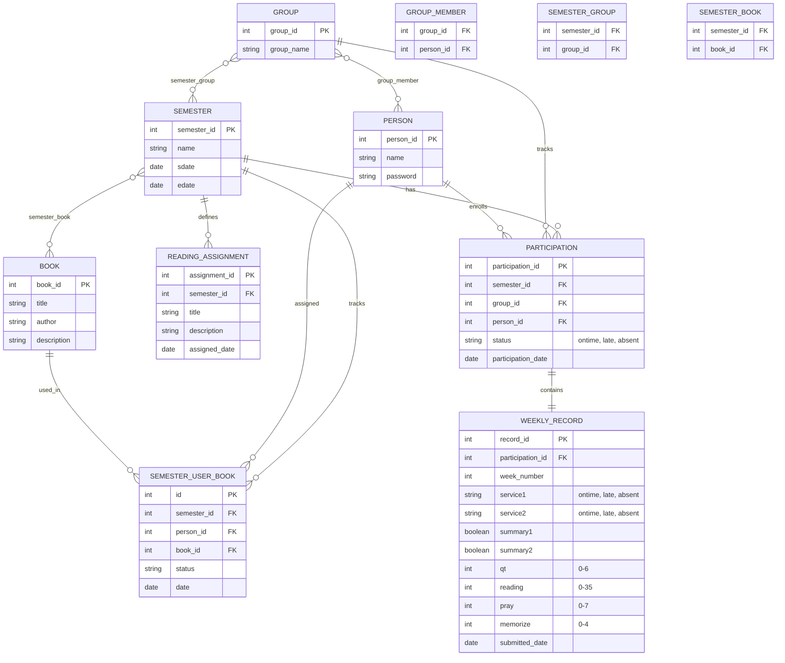

# Semester Reading Group Management System - Project Documentation

## Project Overview

This is a Spring Boot REST API application that provides complete CRUD (Create, Read, Update, Delete) functionality for managing semester-based reading groups. The system tracks reading groups, participants, semesters, books, reading assignments, weekly submission records, book assignments to users, and participation status. The application is designed for educational purposes and includes validation, error handling, and database persistence.

## Technology Stack

### Backend Framework
- **Spring Boot 4.0.2** - Main application framework
- **Java 21** - Programming language
- **Maven 3.x** - Build and dependency management

### Database & Persistence
- **H2 Database** - In-memory relational database
- **Spring Data JPA** - ORM and data access layer
- **Hibernate** - JPA implementation

### Additional Components
- **Spring Web MVC** - REST API framework
- **Spring Session JDBC** - Session management
- **JUnit 5** - Testing framework

### Frontend Framework
- **React 18.2.0** - UI library
- **React Router DOM 6.22.0** - Client-side routing
- **Axios 1.6.7** - HTTP client for API calls
- **Vite 5.1.4** - Build tool and dev server

## Project Structure

```
src/main/java/com/example/sample/
├── SampleApplication.java                   # Main Spring Boot application
├── controller/
│   ├── GroupController.java                 # Group REST endpoints
│   ├── PersonController.java                # Person REST endpoints
│   ├── SemesterController.java              # Semester REST endpoints
│   ├── BookController.java                  # Book REST endpoints
│   ├── SemesterUserBookController.java      # Book assignment REST endpoints
│   ├── ReadingAssignmentController.java     # Reading assignment REST endpoints
│   ├── WeeklyRecordController.java          # Weekly record REST endpoints
│   └── ParticipationController.java         # Participation REST endpoints
├── service/
│   ├── GroupService.java                    # Group business logic
│   ├── PersonService.java                   # Person business logic
│   ├── SemesterService.java                 # Semester business logic
│   ├── BookService.java                     # Book business logic
│   ├── SemesterUserBookService.java         # Book assignment business logic
│   ├── ReadingAssignmentService.java        # Assignment business logic
│   ├── WeeklyRecordService.java             # Record business logic
│   └── ParticipationService.java            # Participation business logic
├── repository/
│   ├── GroupRepository.java                 # Group data access
│   ├── PersonRepository.java                # Person data access
│   ├── SemesterRepository.java              # Semester data access
│   ├── BookRepository.java                  # Book data access
│   ├── SemesterUserBookRepository.java      # Book assignment data access
│   ├── ReadingAssignmentRepository.java     # Assignment data access
│   ├── WeeklyRecordRepository.java          # Record data access
│   └── ParticipationRepository.java         # Participation data access
├── model/
│   ├── Group.java                           # Group entity
│   ├── Person.java                          # Person entity
│   ├── Semester.java                        # Semester entity
│   ├── Book.java                            # Book entity
│   ├── SemesterUserBook.java                # Book assignment entity
│   ├── ReadingAssignment.java               # Reading assignment entity
│   ├── WeeklyRecord.java                    # Weekly record entity
│   └── Participation.java                   # Participation entity
├── exception/
│   └── GlobalExceptionHandler.java          # Error handling
└── init/
    └── DataInitializer.java                 # Default data initialization

src/main/resources/
└── application.properties                    # Application configuration

frontend/
├── public/                                   # Static assets
├── src/
│   ├── App.jsx                              # Main application component
│   ├── main.jsx                             # Application entry point
│   ├── components/
│   │   ├── Dashboard.jsx                    # Dashboard with navigation cards
│   │   ├── Groups.jsx                       # Group management UI
│   │   ├── Persons.jsx                      # Person management UI
│   │   ├── Semesters.jsx                    # Semester management UI with book management
│   │   ├── Books.jsx                        # Book management UI
│   │   ├── SemesterGroups.jsx               # Semester groups navigation
│   │   ├── GroupPersons.jsx                 # Group persons navigation
│   │   ├── Participations.jsx               # Participation and book assignment UI
│   │   └── ReadingAssignments.jsx           # Assignment management UI
│   ├── services/
│   │   ├── apiService.js                    # Axios instance with authentication
│   │   ├── groupService.js                  # Group API calls
│   │   ├── personService.js                 # Person API calls
│   │   ├── semesterService.js               # Semester API calls
│   │   ├── bookService.js                   # Book API calls
│   │   ├── semesterUserBookService.js       # Book assignment API calls
│   │   ├── participationService.js          # Participation API calls
│   │   ├── recordService.js                 # Weekly record API calls
│   │   └── assignmentService.js             # Assignment API calls
│   └── App.css                              # Global styles
├── package.json                             # Frontend dependencies
└── vite.config.js                           # Vite configuration
```

## Database Design / ER Diagram

Below is the Entity-Relationship diagram showing the complete database schema for the semester reading group management system:



### Entity Relationships

- **GROUP** and **PERSON** have many-to-many relationship via **GROUP_MEMBER** junction table
- **GROUP** and **SEMESTER** have many-to-many relationship via **SEMESTER_GROUP** junction table
- **SEMESTER** and **BOOK** have many-to-many relationship via **SEMESTER_BOOK** junction table
- **SEMESTER** defines multiple **READING_ASSIGNMENT** (one-to-many)
- **SEMESTER** has multiple **PARTICIPATION** (one-to-many)
- **SEMESTER** tracks multiple **SEMESTER_USER_BOOK** (one-to-many)
- **GROUP** tracks multiple **PARTICIPATION** (one-to-many)
- **PERSON** enrolls in multiple **PARTICIPATION** (one-to-many)
- **PERSON** assigned multiple **SEMESTER_USER_BOOK** (one-to-many)
- **BOOK** used in multiple **SEMESTER_USER_BOOK** (one-to-many)
- **PARTICIPATION** contains one **WEEKLY_RECORD** (one-to-one)

## Data Model

### 1. Group Entity

| Field      | Type    | Constraints                 | Description                    |
|------------|---------|-----------------------------|--------------------------------|
| groupId    | Integer | Primary Key, Auto-increment | Unique identifier              |
| groupName  | String  | Not null, Unique            | Name of the reading group      |

**Relationships:**
- Many-to-many with Person via group_member junction table
- Many-to-many with Semester via semester_group junction table

### 2. Person Entity

| Field     | Type    | Constraints                 | Description                    |
|-----------|---------|-----------------------------|--------------------------------|
| personId  | Integer | Primary Key, Auto-increment | Unique identifier              |
| name      | String  | Not null                    | Person's full name             |
| password  | String  | Not null                    | Person's password              |

**Relationships:**
- Many-to-many with Group via group_member junction table
- One-to-many with Participation

### 3. Semester Entity

| Field      | Type      | Constraints                 | Description                    |
|------------|-----------|-----------------------------|--------------------------------|
| semesterId | Integer   | Primary Key, Auto-increment | Unique identifier              |
| name       | String    | Not null                    | Name of the semester           |
| sdate      | LocalDate | Not null                    | Semester start date            |
| edate      | LocalDate | Not null                    | Semester end date              |

**Relationships:**
- Many-to-many with Group via semester_group junction table
- Many-to-many with Book via semester_book junction table
- One-to-many with ReadingAssignment
- One-to-many with Participation
- One-to-many with SemesterUserBook

### 4. Book Entity

| Field       | Type    | Constraints                 | Description                    |
|-------------|---------|-----------------------------|--------------------------------|
| bookId      | Integer | Primary Key, Auto-increment | Unique identifier              |
| title       | String  | Not null                    | Book title                     |
| author      | String  | Not null                    | Book author                    |
| description | String  | Nullable, TEXT              | Book description               |

**Relationships:**
- Many-to-many with Semester via semester_book junction table
- One-to-many with SemesterUserBook

### 5. Semester User Book Entity

| Field      | Type      | Constraints                 | Description                    |
|------------|-----------|-----------------------------|--------------------------------|
| id         | Integer   | Primary Key, Auto-increment | Unique identifier              |
| semesterId | Integer   | Foreign Key, Not null       | Reference to Semester          |
| personId   | Integer   | Foreign Key, Not null       | Reference to Person            |
| bookId     | Integer   | Foreign Key, Not null       | Reference to Book              |
| status     | String    | Not null                    | Assignment status              |
| date       | LocalDate | Not null                    | Assignment date                |

**Relationships:**
- Many-to-one with Semester
- Many-to-one with Person
- Many-to-one with Book

### 6. Reading Assignment Entity

| Field        | Type      | Constraints                 | Description                    |
|--------------|-----------|-----------------------------|--------------------------------|
| assignmentId | Integer   | Primary Key, Auto-increment | Unique identifier              |
| semesterId   | Integer   | Foreign Key, Not null       | Reference to Semester          |
| title        | String    | Not null                    | Assignment title               |
| description  | String    | Nullable, TEXT              | Assignment description         |
| assignedDate | LocalDate | Not null                    | Date assignment was given      |

**Relationships:**
- Many-to-one with Semester

### 7. Participation Entity

| Field             | Type      | Constraints                        | Description                    |
|-------------------|-----------|------------------------------------|--------------------------------|
| participationId   | Integer   | Primary Key, Auto-increment        | Unique identifier              |
| semesterId        | Integer   | Foreign Key, Not null              | Reference to Semester          |
| groupId           | Integer   | Foreign Key, Not null              | Reference to Group             |
| personId          | Integer   | Foreign Key, Not null              | Reference to Person            |
| status            | String    | Not null, Enum: ontime/late/absent | Participation status           |
| participationDate | LocalDate | Not null                           | Date of participation          |

**Relationships:**
- Many-to-one with Semester
- Many-to-one with Group
- Many-to-one with Person
- One-to-one with WeeklyRecord

### 8. Weekly Record Entity

| Field           | Type      | Constraints                                 | Description                             |
|-----------------|-----------|---------------------------------------------|-----------------------------------------|
| recordId        | Integer   | Primary Key, Auto-increment                 | Unique identifier                       |
| participationId | Integer   | Foreign Key, Not null                       | Reference to Participation              |
| weekNumber      | Integer   | Not null                                    | Week number                             |
| service1        | String    | Not null, Enum: ontime/late/absent          | First service attendance                |
| service2        | String    | Not null, Enum: ontime/late/absent          | Second service attendance               |
| summary1        | Boolean   | Not null, Default: false                    | First sermon summary completion         |
| summary2        | Boolean   | Not null, Default: false                    | Second sermon summary completion        |
| qt              | Integer   | Not null, Range: 0-6                        | Quiet time count (max 6 days)           |
| reading         | Integer   | Not null, Range: 0-35                       | Bible reading chapters (max 5/day × 7)  |
| pray            | Integer   | Not null, Range: 0-7                        | Prayer count (max 7 days)               |
| memorize        | Integer   | Not null, Range: 0-4                        | Scripture memorization count            |
| submittedDate   | LocalDate | Nullable                                    | Date record was submitted               |

**Relationships:**
- One-to-one with Participation

## API Endpoints

### Groups - `/api/admin/groups`

#### Get All Groups
```http
GET /api/admin/groups
```
**Response:** `200 OK` - List of all groups

#### Get Group by ID
```http
GET /api/admin/groups/{id}
```
**Response:** `200 OK` or `404 Not Found`

#### Get Group by Name
```http
GET /api/admin/groups/name/{groupName}
```
**Response:** `200 OK` or `404 Not Found`

#### Get Group Persons
```http
GET /api/admin/groups/{id}/persons
```
**Response:** `200 OK` - Set of persons in the group

#### Add Person to Group
```http
POST /api/admin/groups/{groupId}/persons/{personId}
```
**Response:** `200 OK` - Updated group

#### Remove Person from Group
```http
DELETE /api/admin/groups/{groupId}/persons/{personId}
```
**Response:** `200 OK` - Updated group

#### Create Group
```http
POST /api/admin/groups
Content-Type: application/json
```
**Request Body:**
```json
{
  "groupName": "Spring 2026 Reading Group"
}
```
**Response:** `201 Created`

#### Update Group
```http
PUT /api/admin/groups/{id}
Content-Type: application/json
```
**Request Body:**
```json
{
  "groupName": "Updated Group Name"
}
```
**Response:** `200 OK` or `400 Bad Request`

#### Delete Group
```http
DELETE /api/admin/groups/{id}
```
**Response:** `200 OK` or `404 Not Found`

---

### Persons - `/api/admin/persons`

#### Get All Persons
```http
GET /api/admin/persons
```
**Response:** `200 OK` - List of all persons

#### Get Person by ID
```http
GET /api/admin/persons/{id}
```
**Response:** `200 OK` or `404 Not Found`

#### Create Person
```http
POST /api/admin/persons
Content-Type: application/json
```
**Request Body:**
```json
{
  "name": "John Doe",
  "password": "password123"
}
```
**Response:** `201 Created`

#### Update Person
```http
PUT /api/admin/persons/{id}
Content-Type: application/json
```
**Request Body:**
```json
{
  "name": "John Doe",
  "password": "newpassword456"
}
```
**Response:** `200 OK` or `400 Bad Request`

#### Delete Person
```http
DELETE /api/admin/persons/{id}
```
**Response:** `200 OK` or `404 Not Found`

---

### Semesters - `/api/admin/semesters`

#### Get All Semesters
```http
GET /api/admin/semesters
```
**Response:** `200 OK` - List of all semesters

#### Get Semester by ID
```http
GET /api/admin/semesters/{id}
```
**Response:** `200 OK` or `404 Not Found`

#### Get Semester Groups
```http
GET /api/admin/semesters/{id}/groups
```
**Response:** `200 OK` - Set of groups in the semester

#### Add Group to Semester
```http
POST /api/admin/semesters/{semesterId}/groups/{groupId}
```
**Response:** `200 OK` - Updated semester

#### Remove Group from Semester
```http
DELETE /api/admin/semesters/{semesterId}/groups/{groupId}
```
**Response:** `200 OK` - Updated semester

#### Create Semester
```http
POST /api/admin/semesters
Content-Type: application/json
```
**Request Body:**
```json
{
  "name": "Spring 2026",
  "sdate": "2026-03-01",
  "edate": "2026-06-30"
}
```
**Response:** `201 Created`

#### Update Semester
```http
PUT /api/admin/semesters/{id}
Content-Type: application/json
```
**Request Body:**
```json
{
  "name": "Spring 2026 Updated",
  "sdate": "2026-03-01",
  "edate": "2026-06-30"
}
```
**Response:** `200 OK` or `400 Bad Request`

#### Delete Semester
```http
DELETE /api/admin/semesters/{id}
```
**Response:** `200 OK` or `404 Not Found`

#### Get Semester Books
```http
GET /api/admin/semesters/{id}/books
```
**Response:** `200 OK` - Set of books in the semester

#### Add Book to Semester
```http
POST /api/admin/semesters/{semesterId}/books?bookId={bookId}
```
**Response:** `200 OK` - Updated semester

#### Remove Book from Semester
```http
DELETE /api/admin/semesters/{semesterId}/books/{bookId}
```
**Response:** `200 OK` - Updated semester

---

### Books - `/api/admin/books`

#### Get All Books
```http
GET /api/admin/books
```
**Response:** `200 OK` - List of all books

#### Get Book by ID
```http
GET /api/admin/books/{id}
```
**Response:** `200 OK` or `404 Not Found`

#### Search Books by Title
```http
GET /api/admin/books/search/title/{keyword}
```
**Response:** `200 OK` - List of books matching the title keyword

#### Search Books by Author
```http
GET /api/admin/books/search/author/{keyword}
```
**Response:** `200 OK` - List of books matching the author keyword

#### Create Book
```http
POST /api/admin/books
Content-Type: application/json
```
**Request Body:**
```json
{
  "title": "The Fellowship of the Ring",
  "author": "J.R.R. Tolkien",
  "description": "The first part of The Lord of the Rings trilogy"
}
```
**Response:** `201 Created`

#### Update Book
```http
PUT /api/admin/books/{id}
Content-Type: application/json
```
**Request Body:**
```json
{
  "title": "Updated Book Title",
  "author": "Updated Author",
  "description": "Updated description"
}
```
**Response:** `200 OK` or `400 Bad Request`

#### Delete Book
```http
DELETE /api/admin/books/{id}
```
**Response:** `200 OK` or `404 Not Found`

---

### Semester User Books - `/api/admin/semester-user-books`

#### Get All Semester User Books
```http
GET /api/admin/semester-user-books
```
**Response:** `200 OK` - List of all book assignments

#### Get Semester User Book by ID
```http
GET /api/admin/semester-user-books/{id}
```
**Response:** `200 OK` or `404 Not Found`

#### Get Semester User Books by Semester
```http
GET /api/admin/semester-user-books/semester/{semesterId}
```
**Response:** `200 OK` - List of book assignments for the semester

#### Get Semester User Books by Person
```http
GET /api/admin/semester-user-books/person/{personId}
```
**Response:** `200 OK` - List of book assignments for the person

#### Get Semester User Books by Book
```http
GET /api/admin/semester-user-books/book/{bookId}
```
**Response:** `200 OK` - List of assignments for the book

#### Get Semester User Books by Semester and Person
```http
GET /api/admin/semester-user-books/semester/{semesterId}/person/{personId}
```
**Response:** `200 OK` - List of book assignments for the person in the semester

#### Get Semester User Books by Semester and Book
```http
GET /api/admin/semester-user-books/semester/{semesterId}/book/{bookId}
```
**Response:** `200 OK` - List of assignments for the book in the semester

#### Create Semester User Book
```http
POST /api/admin/semester-user-books?semesterId={semesterId}&personId={personId}&bookId={bookId}
Content-Type: application/json
```
**Request Body:**
```json
{
  "status": "reading",
  "date": "2026-03-01"
}
```
**Response:** `201 Created`

#### Update Semester User Book
```http
PUT /api/admin/semester-user-books/{id}
Content-Type: application/json
```
**Request Body:**
```json
{
  "status": "completed",
  "date": "2026-03-15"
}
```
**Response:** `200 OK` or `400 Bad Request`

#### Delete Semester User Book
```http
DELETE /api/admin/semester-user-books/{id}
```
**Response:** `200 OK` or `404 Not Found`

---

### Reading Assignments - `/api/admin/assignments`

#### Get All Assignments
```http
GET /api/admin/assignments
```

#### Get Assignment by ID
```http
GET /api/admin/assignments/{id}
```

#### Get Assignments by Semester
```http
GET /api/admin/assignments/semester/{semesterId}
```

#### Create Assignment
```http
POST /api/admin/assignments?semesterId={semesterId}
Content-Type: application/json
```
**Request Body:**
```json
{
  "title": "Chapter 1-3: Introduction to Java",
  "description": "Read and understand the basics of Java programming",
  "assignedDate": "2026-03-01"
}
```
**Response:** `201 Created`

#### Update Assignment
```http
PUT /api/admin/assignments/{id}
```

#### Delete Assignment
```http
DELETE /api/admin/assignments/{id}
```

---

### Weekly Records - `/api/admin/records`

#### Get All Records
```http
GET /api/admin/records
```
**Response:** `200 OK` - List of all weekly records

#### Get Record by ID
```http
GET /api/admin/records/{id}
```
**Response:** `200 OK` or `404 Not Found`

#### Get Records by Person
```http
GET /api/admin/records/person/{personId}
```
**Response:** `200 OK` - List of records for the person

#### Get Records by Semester
```http
GET /api/admin/records/semester/{semesterId}
```
**Response:** `200 OK` - List of records for the semester

#### Get Records by Person and Semester
```http
GET /api/admin/records/person/{personId}/semester/{semesterId}
```
**Response:** `200 OK` - List of records for the person in the semester

#### Create Weekly Record
```http
POST /api/admin/records?participationId={participationId}
Content-Type: application/json
```
**Request Body:**
```json
{
  "weekNumber": 1,
  "service1": "ontime",
  "service2": "late",
  "summary1": true,
  "summary2": false,
  "qt": 6,
  "reading": 35,
  "pray": 7,
  "memorize": 4,
  "submittedDate": "2026-03-08"
}
```
**Response:** `201 Created`

**Validation Rules:**
- **service1, service2:** Must be "ontime", "late", or "absent" (case-insensitive)
- **summary1, summary2:** Boolean values
- **qt:** Integer between 0 and 6 (daily quiet time count)
- **reading:** Integer between 0 and 35 (Bible chapters read)
- **pray:** Integer between 0 and 7 (daily prayer count)
- **memorize:** Integer between 0 and 4 (scriptures memorized)

**Note:** A WeeklyRecord must be associated with a Participation. Create the Participation first, then create the WeeklyRecord.

#### Update Record
```http
PUT /api/admin/records/{id}
Content-Type: application/json
```
**Request Body:**
```json
{
  "weekNumber": 2,
  "service1": "ontime",
  "service2": "ontime",
  "summary1": true,
  "summary2": true,
  "qt": 5,
  "reading": 30,
  "pray": 6,
  "memorize": 3,
  "submittedDate": "2026-03-15"
}
```
**Response:** `200 OK` or `400 Bad Request`

#### Delete Record
```http
DELETE /api/admin/records/{id}
```
**Response:** `200 OK` or `404 Not Found`

---

### Participations - `/api/admin/participations`

#### Get All Participations
```http
GET /api/admin/participations
```
**Response:** `200 OK` - List of all participations

#### Get Participation by ID
```http
GET /api/admin/participations/{id}
```
**Response:** `200 OK` or `404 Not Found`

#### Get Participations by Semester
```http
GET /api/admin/participations/semester/{semesterId}
```
**Response:** `200 OK` - List of participations for the semester

#### Get Participations by Group
```http
GET /api/admin/participations/group/{groupId}
```
**Response:** `200 OK` - List of participations for the group

#### Get Participations by Person
```http
GET /api/admin/participations/person/{personId}
```
**Response:** `200 OK` - List of participations for the person

#### Create Participation
```http
POST /api/admin/participations?semesterId={semesterId}&groupId={groupId}&personId={personId}
Content-Type: application/json
```
**Request Body:**
```json
{
  "status": "ontime",
  "participationDate": "2026-03-08"
}
```
**Response:** `201 Created`

**Valid status values:** `ontime`, `late`, `absent`

**Note:** After creating a Participation, you can create a WeeklyRecord for it.

#### Update Participation
```http
PUT /api/admin/participations/{id}
Content-Type: application/json
```
**Request Body:**
```json
{
  "status": "late",
  "participationDate": "2026-03-09"
}
```
**Response:** `200 OK` or `400 Bad Request`

#### Delete Participation
```http
DELETE /api/admin/participations/{id}
```
**Response:** `200 OK` or `404 Not Found`

**Note:** Deleting a Participation will also delete its associated WeeklyRecord (cascade delete).

## Setup and Installation

### Prerequisites
- Java 21 or higher
- Maven 3.x (or use included Maven wrapper)

### Running the Application

1. **Using Maven Wrapper (recommended):**
   ```bash
   ./mvnw spring-boot:run
   ```

2. **Using Maven:**
   ```bash
   mvn spring-boot:run
   ```

3. **Building JAR and running:**
   ```bash
   ./mvnw clean package
   java -jar target/sample-0.0.1-SNAPSHOT.jar
   ```

The application will start on `http://localhost:8080`

### Running the Frontend

1. **Navigate to frontend directory:**
   ```bash
   cd frontend
   ```

2. **Install dependencies:**
   ```bash
   npm install
   ```

3. **Start development server:**
   ```bash
   npm run dev
   ```

The frontend will start on `http://localhost:5173`

**Note:** Make sure the backend is running on port 8080 before starting the frontend.

### Frontend Navigation Flow

The React frontend provides an intuitive navigation flow for managing participations:

**Navigation Path:**
1. **Dashboard** (`/`) - Main entry point with cards for each entity
2. **Semesters** (`/semesters`) - View and manage semesters, assign books to semesters
3. **Semester Groups** (`/semesters/:semesterId/groups`) - View groups in a semester
4. **Group Persons** (`/semesters/:semesterId/groups/:groupId/persons`) - View persons in a group
5. **Participations** (`/semesters/:semesterId/groups/:groupId/persons/:personId/participations`) - Manage participations, book assignments, and weekly records

**Key Features:**
- **Books Management** - Create, edit, view, and delete books with search functionality
- **Semester Book Assignment** - Assign books to semesters via modal interface
- **Person Book Assignment** - Track which books are assigned to each person in a semester
- **Participation CRUD** - Full create, read, update, delete operations for participations
- **Weekly Records** - Track service attendance, sermon summaries, and spiritual activities
- **Modal-based UI** - Clean interface with modals for all create/edit operations
- **Real-time Updates** - Data refreshes automatically after operations

### Default Data Initialization

The application automatically creates default data on startup via `DataInitializer.java`:

**Default Admin Account:**
- **Username:** admin
- **Password:** password123

**Default Data Created:**
- 3 sample persons (Alice, Bob, Charlie)
- 2 groups (Spring Reading Group, Summer Study Group)
- 2 semesters (Spring 2026, Summer 2026)
- 3 books (The Fellowship of the Ring, The Two Towers, The Return of the King)
- Persons are automatically added to groups
- Groups are automatically added to semesters
- Books are automatically added to semesters

This eliminates the need for manual data setup via cURL commands during development.

## Database Access

### H2 Console
Access the H2 database console at: `http://localhost:8080/h2-console`

**Connection Details:**
- **JDBC URL:** `jdbc:h2:mem:testdb`
- **Username:** `sa`
- **Password:** (leave empty)

### Database Configuration
The H2 database is configured as an in-memory database, which means:
- Data is lost when the application stops
- Perfect for development and testing
- No external database installation required

## Testing the API - Complete Workflow

### Using cURL

**1. Create a group:**
```bash
curl -X POST http://localhost:8080/api/admin/groups \
  -H "Content-Type: application/json" \
  -d '{"groupName":"Spring 2026 Reading Group"}'
```

**2. Create a person:**
```bash
curl -X POST "http://localhost:8080/api/admin/persons" \
  -H "Content-Type: application/json" \
  -d '{"name":"John Doe","password":"password123"}'
```

**3. Add person to group:**
```bash
curl -X POST "http://localhost:8080/api/admin/groups/1/persons/1"
```

**4. Create a semester:**
```bash
curl -X POST "http://localhost:8080/api/admin/semesters" \
  -H "Content-Type: application/json" \
  -d '{"name":"Spring 2026","sdate":"2026-03-01","edate":"2026-06-30"}'
```

**5. Add group to semester:**
```bash
curl -X POST "http://localhost:8080/api/admin/semesters/1/groups/1"
```

**6. Create a reading assignment:**
```bash
curl -X POST "http://localhost:8080/api/admin/assignments?semesterId=1" \
  -H "Content-Type: application/json" \
  -d '{"title":"Chapter 1-3","description":"Introduction to Java","assignedDate":"2026-03-01"}'
```

**7. Create a participation:**
```bash
curl -X POST "http://localhost:8080/api/admin/participations?semesterId=1&groupId=1&personId=1" \
  -H "Content-Type: application/json" \
  -d '{"status":"ontime","participationDate":"2026-03-08"}'
```

**8. Create a book:**
```bash
curl -X POST "http://localhost:8080/api/admin/books" \
  -H "Content-Type: application/json" \
  -d '{"title":"The Fellowship of the Ring","author":"J.R.R. Tolkien","description":"First book of The Lord of the Rings"}'
```

**9. Add book to semester:**
```bash
curl -X POST "http://localhost:8080/api/admin/semesters/1/books?bookId=1"
```

**10. Assign book to a person for the semester:**
```bash
curl -X POST "http://localhost:8080/api/admin/semester-user-books?semesterId=1&personId=1&bookId=1" \
  -H "Content-Type: application/json" \
  -d '{"status":"reading","date":"2026-03-08"}'
```

**11. Create a participation:**
```bash
curl -X POST "http://localhost:8080/api/admin/participations?semesterId=1&groupId=1&personId=1" \
  -H "Content-Type: application/json" \
  -d '{"status":"ontime","participationDate":"2026-03-08"}'
```

**12. Create a weekly record for the participation:**
```bash
curl -X POST "http://localhost:8080/api/admin/records?participationId=1" \
  -H "Content-Type: application/json" \
  -d '{"weekNumber":1,"service1":"ontime","service2":"ontime","summary1":true,"summary2":true,"qt":6,"reading":35,"pray":7,"memorize":4,"submittedDate":"2026-03-08"}'
```

**Query Examples:**

```bash
# Get all persons in a group
curl http://localhost:8080/api/admin/groups/1/persons

# Get all groups in a semester
curl http://localhost:8080/api/admin/semesters/1/groups

# Get all books in a semester
curl http://localhost:8080/api/admin/semesters/1/books

# Get all book assignments for a person
curl http://localhost:8080/api/admin/semester-user-books/person/1

# Get all book assignments for a semester
curl http://localhost:8080/api/admin/semester-user-books/semester/1

# Get all participations for a person
curl http://localhost:8080/api/admin/participations/person/1

# Get all weekly records for a person
curl http://localhost:8080/api/admin/records/person/1

# Get all assignments for a semester
curl http://localhost:8080/api/admin/assignments/semester/1

# Search books by title
curl http://localhost:8080/api/admin/books/search/title/Fellowship

# Search books by author
curl http://localhost:8080/api/admin/books/search/author/Tolkien
```

### Using Postman or Similar Tools

Base URLs:
- Groups: `http://localhost:8080/api/admin/groups`
- Persons: `http://localhost:8080/api/admin/persons`
- Semesters: `http://localhost:8080/api/admin/semesters`
- Books: `http://localhost:8080/api/admin/books`
- Semester User Books: `http://localhost:8080/api/admin/semester-user-books`
- Assignments: `http://localhost:8080/api/admin/assignments`
- Records: `http://localhost:8080/api/admin/records`
- Participations: `http://localhost:8080/api/admin/participations`

Set `Content-Type: application/json` header for POST/PUT requests

## Features

### Validation Rules
- **Group name uniqueness:** Enforced across all groups
- **Weekly Record - Service attendance:** service1 and service2 must be "ontime", "late", or "absent" (case-insensitive)
- **Weekly Record - QT:** Must be between 0 and 6 (daily quiet time)
- **Weekly Record - Reading:** Must be between 0 and 35 (Bible chapters)
- **Weekly Record - Pray:** Must be between 0 and 7 (daily prayer)
- **Weekly Record - Memorize:** Must be between 0 and 4 (scripture verses)
- **Participation status:** Must be "ontime", "late", or "absent" (case-insensitive)
- **Participation date:** Required when creating participation
- **Semester dates:** End date must be after start date
- **Existence checks:** Validates entities exist before create/update/delete operations
- **Foreign key validation:** Validates referenced entities (semester, group, person, book) exist when creating relationships

### Error Handling
- **Global exception handler:** Centralized error handling across all endpoints
- **Consistent error format:** All errors return JSON with success flag and error message
- **HTTP status codes:** Proper status codes (400, 404, 500) for different error types

### Cascade Operations
- **Participation deletion:** Deleting a participation also deletes its associated weekly record (orphan removal)
- **Many-to-many relationships:** Junction tables automatically managed by JPA

### Book Management Features
- **Book CRUD:** Complete create, read, update, delete operations for books
- **Book Search:** Search books by title or author with keyword matching
- **Semester-Book Association:** Assign multiple books to semesters
- **User Book Tracking:** Track book assignments to users with status and date
- **Frontend Integration:** React components for books, with modals for CRUD operations

### Spiritual Activity Tracking
- **Service Attendance:** Track attendance for two weekly services (ontime/late/absent)
- **Sermon Summaries:** Record completion of summaries for both services
- **Quiet Time:** Track daily quiet time (0-6 days per week)
- **Bible Reading:** Track chapters read (0-35, assuming 5 chapters/day × 7 days)
- **Prayer:** Track daily prayer count (0-7 days per week)
- **Scripture Memorization:** Track verses memorized (0-4 per week)

### Data Persistence
- JPA/Hibernate automatic table creation
- Schema auto-updated based on entity changes
- SQL logging enabled for debugging
- Default data initialization on startup

## Configuration

### application.properties
```properties
# Application name
spring.application.name=sample

# H2 Database
spring.datasource.url=jdbc:h2:mem:testdb
spring.datasource.driverClassName=org.h2.Driver
spring.datasource.username=sa
spring.datasource.password=

# JPA/Hibernate
spring.jpa.database-platform=org.hibernate.dialect.H2Dialect
spring.jpa.hibernate.ddl-auto=update
spring.jpa.show-sql=true
spring.jpa.properties.hibernate.format_sql=true

# H2 Console
spring.h2.console.enabled=true
spring.h2.console.path=/h2-console
```

## Architecture

### Layered Architecture
1. **Controller Layer** - Handles HTTP requests and responses
2. **Service Layer** - Contains business logic and validation
3. **Repository Layer** - Manages data persistence
4. **Model Layer** - Defines data entities with JPA relationships

### Design Patterns
- **Repository Pattern** - Abstracts data access logic
- **Dependency Injection** - Loose coupling through Spring DI
- **Many-to-Many Relationships** - Junction tables (group_member, semester_group, semester_book) managed by JPA
- **One-to-One Relationships** - Participation and WeeklyRecord with cascade operations
- **One-to-Many Relationships** - Proper JPA entity relationships with cascade operations
- **Data Initialization** - CommandLineRunner pattern for default data setup
- **DTO Pattern** - (Can be extended) Separate API models from entities

## Security Considerations

**Note:** This is a basic implementation. For production use, consider:

1. **Authentication:** No authentication mechanism
   - Implement JWT or session-based authentication

2. **Authorization:** No role-based access control
   - Add method-level security with Spring Security

3. **Input Validation:** Basic validation only
   - Add Bean Validation (@Valid, @NotBlank, etc.)

4. **API Security:** No rate limiting or CORS configuration
   - Configure CORS for frontend integration
   - Add rate limiting to prevent abuse

5. **Data Privacy:** No password encryption
   - Implement password hashing (BCrypt, Argon2, etc.)
   - Never store passwords in plain text

## Future Enhancements

- [ ] Implement authentication and authorization
- [ ] Add pagination and sorting for list endpoints
- [ ] Add search and filtering capabilities
- [ ] Implement DTO pattern to separate API models from entities
- [ ] Add comprehensive unit and integration tests
- [ ] Add API documentation (Swagger/OpenAPI)
- [ ] Implement soft delete instead of hard delete
- [ ] Add audit logging for all CRUD operations
- [ ] Configure profile-based properties (dev, prod)
- [ ] Add analytics endpoints (average scores, participation rates)
- [ ] Implement email notifications for assignment deadlines
- [ ] Add batch operations for creating multiple records

## Troubleshooting

### Application won't start
- Verify Java 21 is installed: `java -version`
- Check port 8080 is not in use
- Review console logs for specific errors

### Database connection errors
- H2 console should be accessible at `/h2-console`
- Verify JDBC URL matches configuration

### API returns 404
- Ensure application is running
- Check endpoint URL includes correct base path (e.g., `/api/admin/groups`)
- Verify HTTP method matches endpoint definition

### Foreign key constraint errors
- Ensure referenced entities exist before creating relationships
- Example workflow:
  1. Create Group and Person first
  2. Add Person to Group using the add endpoint
  3. Create Semester and add Group to it
  4. Create Book and add it to Semester
  5. Create SemesterUserBook to assign a book to a person for a semester
  6. Create Participation with valid semesterId, groupId, and personId
  7. Create WeeklyRecord with valid participationId
- **Note:** With DataInitializer, default entities are created automatically on startup
## Project Information

- **Created:** February 2026
- **Spring Boot Version:** 4.0.2
- **Java Version:** 21
- **Build Tool:** Maven
- **Database:** H2 (In-Memory)

---

**Note:** This project is designed for educational purposes and demonstrates Spring Boot CRUD operations with JPA entity relationships. Additional security and production-ready features should be implemented before deploying to production.